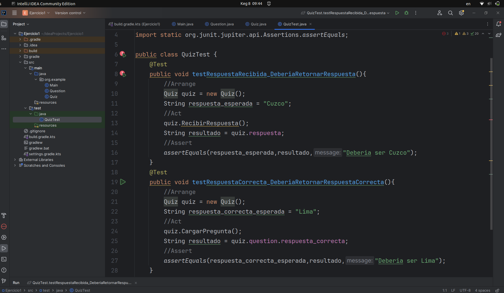

# Sprint 1

## 1) Configurar el entorno del proyecto utilizando Gradle, incluyendo la dependencia para JUnit 5.
Se crea un proyecto en IntelliJ IDEA usando Gradle e incluyendo la dependencia para JUnit 5  


## 2) Desarrollar la clase Question con atributos para la descripción de la pregunta, las opciones disponibles y la respuesta correcta.
Se crea la clase Question con los atributos correspondientes  


## 3) Implementar la clase Quiz que manejará el flujo del juego, incluyendo cargar preguntas, presentarlas al usuario y recibir respuestas.
Se crea la clase Quiz con los metodos CargarPregunta(), MostrarPregunta() y RecibirRespuesta().

``` java
package org.example;

import java.util.Scanner;

public class Quiz {
    String respuesta;
    String opcion;
    Question question = new Question();
    Scanner lector = new Scanner(System.in);
    public void CargarPregunta(){
        System.out.println("Ingresa la pregunta: ");
        question.descripcion_pregunta = lector.nextLine();
        for(int i=0; i<4; i++){
            System.out.println("Ingresa la opcion " + (i+1));
            opcion = lector.nextLine();
            question.opciones_disponibles.add(opcion);
        }
        System.out.println("Ingresa la respuesta correcta: ");
        question.respuesta_correcta = lector.nextLine();
    }
    public void MostrarPregunta(){
        int i=1;
        System.out.println("Pregunta: " + question.descripcion_pregunta);
        for(Object opc: question.opciones_disponibles){
            System.out.println(i + ") "+ opc);
            i++;
        }
        RecibirRespuesta();
    }
    public void RecibirRespuesta(){
        Scanner lector = new Scanner(System.in);
        System.out.println("Ingresa tu respuesta: ");
        String respuesta_recibida = lector.nextLine();
        respuesta = respuesta_recibida;
    }
}
```   


## 4) Programar la lógica para mostrar preguntas de manera secuencial y permitir al usuario ingresar respuestas.
Se programa la parte logica.  


Ejecucion de la clase main.  


## 5) Escribir pruebas unitarias para asegurar que las preguntas se carguen correctamente y que las respuestas sean validadas adecuadamente.
Se escribe dos pruebas unitarias para este sprint 1




```OBSERVACION```   Debido a que los metodos de la clase Quiz son de tipo void, fallan las pruebas al ejecutarlas. Ello se solucionara en el siguiente sprint.
