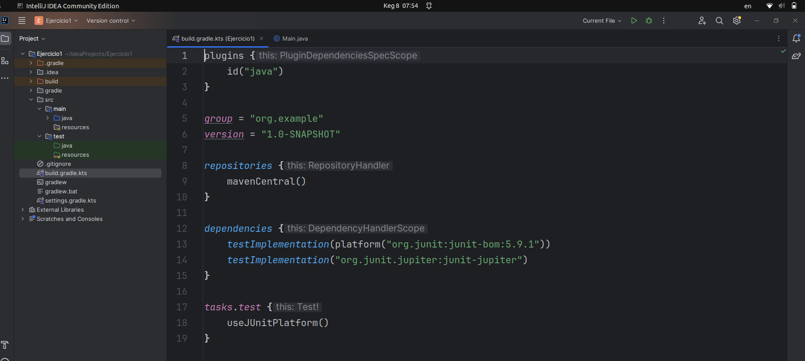
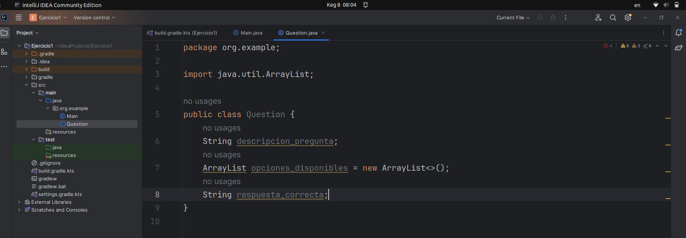
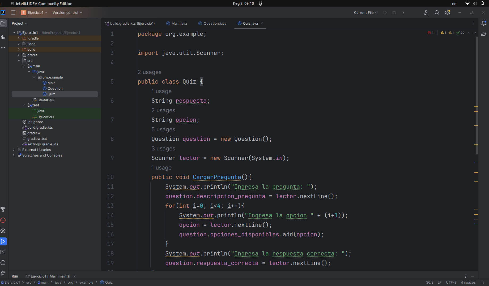
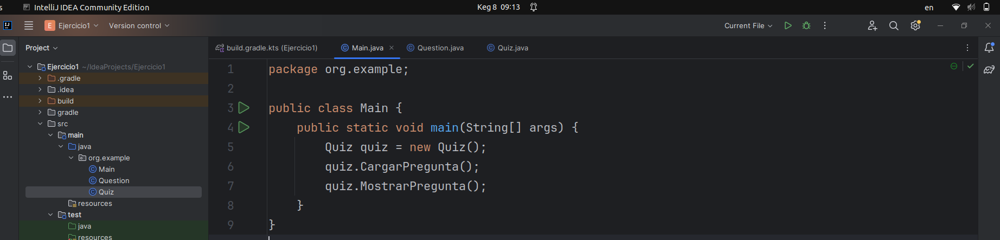
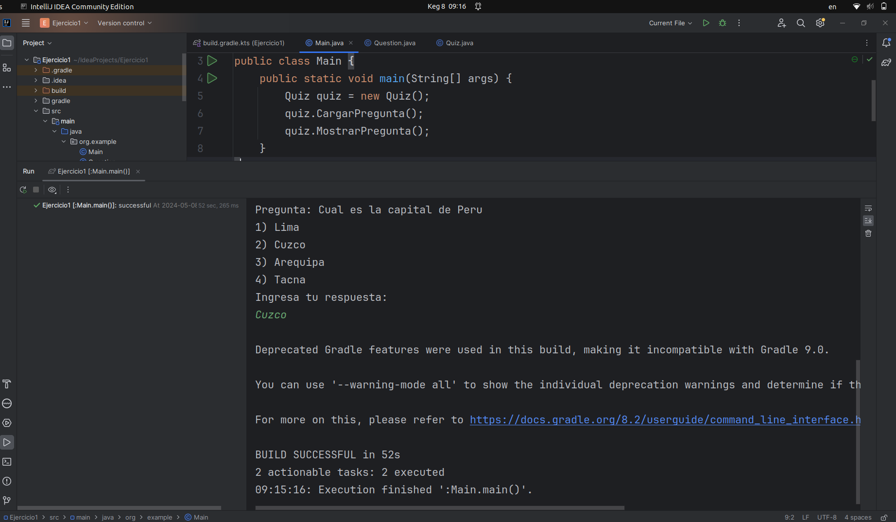

# Sprint 1

## 1) Configurar el entorno del proyecto utilizando Gradle, incluyendo la dependencia para JUnit 5.
Se crea un proyecto en IntelliJ IDEA usando Gradle e incluyendo la dependencia para JUnit 5  

## 2) Desarrollar la clase Question con atributos para la descripción de la pregunta, las opciones disponibles y la respuesta correcta.
Se crea la clase Question con los atributos correspondientes  

## 3) Implementar la clase Quiz que manejará el flujo del juego, incluyendo cargar preguntas, presentarlas al usuario y recibir respuestas.
Se crea la clase Quiz con los metodos CargarPregunta(), MostrarPregunta() y RecibirRespuesta().

## 4) Programar la lógica para mostrar preguntas de manera secuencial y permitir al usuario ingresar respuestas.
Se programa la parte logica.  

Ejecucion de la clase main.  

